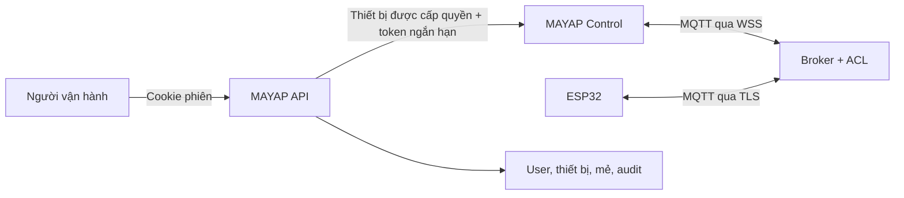

# MAYAP Control v1.3.1

Trung tâm vận hành máy ấp trứng MAYAP dành cho môi trường production. Ứng dụng theo dõi telemetry thật, quản lý mẻ ấp, nhận cảnh báo, thay đổi cấu hình và gửi lệnh có thời hạn tới ESP32 qua MQTT over WebSocket.

> Trạng thái bàn giao: frontend production-ready. Ứng dụng cố ý **không có dữ liệu mô phỏng** và **không nhúng tài khoản MQTT**. Các nút điều khiển chỉ mở khi backend xác thực, broker và ESP32 thực sự online.

## Điểm khác với bản demo

- Tài khoản người dùng, vai trò `owner/operator/viewer` và danh sách thiết bị được cấp từ backend.
- MQTT bắt buộc dùng `wss://` với credential ngắn hạn; không có broker công khai hay mật khẩu tĩnh trong JavaScript.
- Mỗi lệnh chứa `requestId`, `sequence`, `bootId`, `expiresAt` và thời gian hiệu lực để ESP32 chống phát lại.
- Chỉ subscribe/publish trong phạm vi thiết bị backend cấp quyền.
- Thao tác bắt đầu mẻ, kết thúc mẻ và Auto Tune có bước xác nhận.
- Dữ liệu quá hạn được đánh dấu offline; website không tiếp tục gửi lệnh khi mất kết nối.
- PWA có thể cài đặt và mở giao diện khi offline, nhưng không giả vờ rằng lệnh đã được gửi.
- Giao diện responsive, trạng thái trống rõ ràng và không tạo telemetry giả.

## Chạy dự án

Yêu cầu Node.js 20 trở lên.

```bash
npm ci
npm run dev
```

Kiểm tra trước khi phát hành:

```bash
npm run check
```

Build production nằm trong `dist/`:

```bash
npm run build
npm run preview
```

Để cập nhật GitHub Pages khi nguồn đang đặt là `main / (root)`:

```bash
npm run build:pages
```

Lệnh này build ứng dụng rồi đồng bộ artifact production vào thư mục gốc. `src/index.html` là HTML nguồn dành cho Vite; `index.html` ở thư mục gốc là HTML đã biên dịch dành cho GitHub Pages. Commit cả hai nhóm thay đổi trước khi push.

## Cấu hình môi trường

Sao chép `config.production.example.json` thành `public/config.json`, sau đó thay các domain mẫu bằng dịch vụ thật. File này là cấu hình công khai; tuyệt đối không đặt password, API secret, JWT dài hạn hoặc tài khoản broker vào đây.

```json
{
  "environment": "production",
  "apiBaseUrl": "https://api.example.com",
  "sessionEndpoint": "/v1/mqtt/session",
  "pairingEndpoint": "/v1/devices/pair",
  "loginUrl": "https://account.example.com/dang-nhap",
  "supportUrl": "https://example.com/ho-tro",
  "topicRoot": "mayap/v1",
  "staleAfterMs": 90000
}
```

Khi `environment` là `unconfigured`, ứng dụng vào fail-safe: hiển thị trạng thái cấu hình thiếu, không mở MQTT và không cho gửi lệnh.

## Kiến trúc production



Frontend tĩnh không thể tự bảo vệ secret. Backend và broker trong sơ đồ là thành phần bắt buộc trước khi bán sản phẩm thật. Xem hợp đồng tích hợp tại [docs/BACKEND_CONTRACT.md](docs/BACKEND_CONTRACT.md), giao thức MQTT tại [docs/MQTT_PROTOCOL.md](docs/MQTT_PROTOCOL.md), và checklist phát hành tại [docs/PRODUCTION_CHECKLIST.md](docs/PRODUCTION_CHECKLIST.md).

Để test truyền/nhận thật trước khi có hạ tầng production, dùng bộ backend + Mosquitto + firmware ESP32 trong [examples/connectivity-test](examples/connectivity-test/README.md).

## Phân quyền

| Vai trò | Xem dữ liệu | Sửa cấu hình | Gửi lệnh |
|---|---:|---:|---:|
| `owner` | Có | Có | Có |
| `operator` | Có | Có | Có |
| `viewer` | Có | Không | Không |

Backend/broker phải áp dụng cùng quy tắc. Việc khóa nút trên frontend chỉ là lớp UX, không phải ranh giới bảo mật.

## Triển khai

Triển khai thư mục `dist/` lên hosting HTTPS có custom domain và chính sách cache phù hợp. Bản GitHub Pages hiện tại được cung cấp để kiểm tra frontend và tích hợp ban đầu; không nên dùng Pages làm hạ tầng thương mại chính cho dịch vụ SaaS/điều khiển thiết bị.

- `index.html`, `config.json`: `Cache-Control: no-cache`
- asset có hash trong `/assets/`: `Cache-Control: public, max-age=31536000, immutable`
- bật HSTS, CSP, `X-Content-Type-Options: nosniff`, `Referrer-Policy` và frame protection tại CDN/reverse proxy
- API chỉ cho phép CORS từ domain website production

## Phạm vi hiện tại

Frontend đã hoàn thiện theo hướng thương mại, nhưng toàn hệ thống chỉ sẵn sàng bán sau khi backend xác thực, broker ACL, firmware chống replay, lưu audit, cảnh báo nền và quy trình thử nghiệm phần cứng trong checklist đều đạt. Không nên quảng cáo đây là hệ thống an toàn sinh học hoặc điều khiển công nghiệp được chứng nhận nếu chưa có kiểm định tương ứng.

## Bảo mật

Xem [SECURITY.md](SECURITY.md). Không gửi lỗ hổng hoặc credential thật qua issue công khai.
