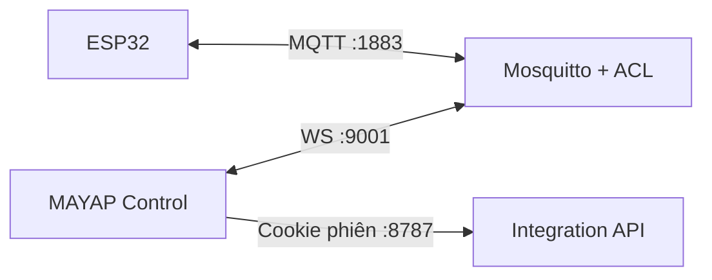

# Bộ test kết nối thật MAYAP

Bộ mẫu này tạo một đường truyền hai chiều hoạt động thật trên máy phát triển:



Telemetry trong dashboard đến từ ESP32 qua broker; lệnh/cấu hình từ giao diện đi ngược lại tới ESP32. Không có đoạn nối tắt hoặc mock trong frontend.

## Thành phần

- `compose.yaml`: Mosquitto và API cấp phiên cho trình duyệt.
- `broker/acl`: tách quyền tài khoản web và tài khoản ESP32 theo từng topic.
- `api/server.mjs`: login cookie, `/v1/mqtt/session`, pairing và lưu kế hoạch mẻ trong RAM.
- `frontend-config.local.json`: cấu hình frontend chạy local.
- `esp32/`: firmware PlatformIO nhận lệnh, gửi presence/snapshot/config/ack/log.

## 1. Khởi động broker và API

Yêu cầu Docker Desktop/Compose và Node.js 20+.

Tại thư mục này:

```bash
cp .env.example .env
```

Đổi toàn bộ password trong `.env`, sau đó:

```bash
docker compose up -d
docker compose ps
```

Kiểm tra API:

```bash
curl http://localhost:8787/health
```

Kết quả phải chứa `"ok":true`.

## 2. Chạy frontend local

Từ thư mục gốc repository:

```bash
cp examples/connectivity-test/frontend-config.local.json public/config.json
npm ci
npm run dev
```

Mở `http://localhost:8787/dev-login`, nhập `DEV_LOGIN_PASSWORD` trong `.env`. Sau khi login, trình duyệt được chuyển về `http://localhost:5173` và nhận phiên MQTT thật.

`public/config.json` local không được commit lên bản Pages. Sau khi test, khôi phục file về `environment: "unconfigured"` hoặc cấu hình HTTPS/WSS production.

## 3. Nạp firmware ESP32

Yêu cầu PlatformIO. Trong `esp32/`:

```bash
cp include/secrets.example.h include/secrets.h
```

Sửa `include/secrets.h`:

- Wi-Fi thật của ESP32.
- `MQTT_HOST`: IP LAN của máy chạy Docker, ví dụ `192.168.1.20`; không dùng `localhost`.
- `MQTT_PASSWORD`: giống `DEVICE_MQTT_PASSWORD` trong `.env`.
- Device ID phải giữ `MAP-A1B2C3D4E5F6` khi dùng ACL mẫu.

Nạp và mở Serial Monitor:

```bash
pio run --target upload
pio device monitor
```

Khi Serial hiện `MQTT đã kết nối và subscribe đầy đủ`, dashboard sẽ nhận:

- presence online;
- cấu hình hiện hành;
- nhiệt độ/độ ẩm mỗi 2 giây;
- log khởi động.

## 4. Test hai chiều

1. Mở dashboard và xác nhận trạng thái thiết bị online.
2. Thay đổi nhiệt độ đặt hoặc chu kỳ đảo, chọn **Lưu và xác nhận**.
3. ESP32 kiểm tra revision/dải an toàn, trả `ack`, rồi phát lại `config/reported`.
4. Tạo kế hoạch mẻ và chọn **Bắt đầu mẻ**.
5. ESP32 kiểm tra `bootId`, sequence và thời gian hết hạn; sau đó trả ack và event code `20`.
6. Trạng thái gia nhiệt/mẻ trên dashboard phải thay đổi theo snapshot kế tiếp.

Theo dõi thô toàn bộ dữ liệu ESP32 từ broker:

```bash
docker compose exec broker sh -lc 'mosquitto_sub -h 127.0.0.1 -p 1883 -u mayap-web-test -P "$WEB_MQTT_PASSWORD" -t "mayap/v1/MAP-A1B2C3D4E5F6/#" -v'
```

## Chuyển từ test sang production

Code mẫu là nền móng tích hợp, nhưng các điểm sau phải được thay trước khi bán:

- API mẫu cố ý từ chối `NODE_ENV=production`; thay login DEV bằng hệ thống tài khoản/database thật.
- Không trả password MQTT tĩnh. Backend production phải cấp token 5–15 phút và broker kiểm tra ACL động theo user/device.
- Dùng HTTPS cho API, WSS cho trình duyệt và MQTTS/TLS cho ESP32; cài CA thật, không dùng `setInsecure()`.
- Lưu session, pairing, batch plan và audit trong database; thêm CSRF protection và rate limit dùng Redis/gateway.
- Firmware phải lưu sequence/config vào NVS an toàn, thay telemetry test bằng driver cảm biến thật và bổ sung watchdog/fail-safe phần cứng.
- Broker production không mở cổng plaintext ra Internet; MQTT `1883` trong mẫu chỉ dành cho LAN kiểm thử.

Tham chiếu giao thức đầy đủ: [`../../docs/MQTT_PROTOCOL.md`](../../docs/MQTT_PROTOCOL.md).

