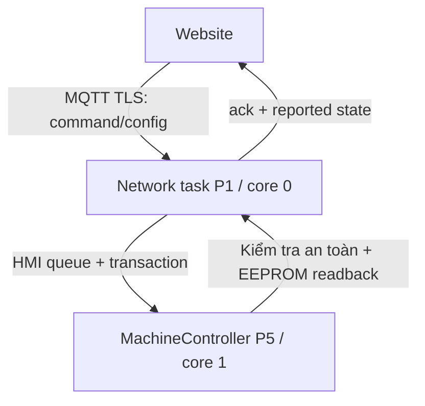

# Firmware MAYAP Industrial v3.2.9 + Web Bridge

Đây là bản firmware tích hợp cuối để kiểm thử trên bo `ESP32-S3-WROOM-1U-N8` (8 MB flash, không PSRAM). Lõi điều khiển/HMI từ gói `MAYAP_OFFLINE_INDUSTRIAL_v3_2_9(2).zip` được giữ nguyên; cầu nối mạng chỉ đi qua API transaction/hàng đợi HMI đã có.

## Bảo toàn bộ code đã kiểm thử

| File nguồn | SHA-256 trước tích hợp | Cách xử lý |
|---|---|---|
| `machine_control.h` | `24bb885ee317d34b9477f66e8b249b8ea7fd93632f4cf67e9bfb67df5b607308` | Giữ nguyên 100%; CI kiểm tra checksum |
| `hmi.h` | `d6076ab8cb69d71f9a0961a4cc6a86d19985985bdf5832b444a8dfb44202810f` | Chỉ thêm API cầu nối và callback kết quả |
| `config.h` | `db1bc9b2abfbf05029cd2f9b2416286fdd5d401880eaa8f4f5cebc61db9754c5` | Chỉ thêm hằng số task mạng và khai báo API |
| `.ino` | `eb95f008c83d3c4ddcc1a66d8adb2b98ce5b0ad99ce863a0f327f9c25bad65ce` | Đổi tên `main.cpp`; thêm 3 điểm gọi bridge |

Checksum của file ZIP gốc: `523b91f3e1f7efe2b7108c6bcabf3b0428e8faf45c6c60d606922e64ff951492`.

Network task chạy core 0, priority 1; HMI vẫn core 0, priority 2; control/supervisor vẫn core 1, priority 5/6. Network task không sở hữu GPIO output, không tham gia control watchdog và không gọi relay.

## Chuẩn bị credential

```bash
cd firmware/mayap-industrial-v3.2.9
cp include/network_secrets.example.h include/network_secrets.h
```

Sửa `include/network_secrets.h`:

- mỗi máy có `NETWORK_DEVICE_ID` duy nhất dạng `MAP-` + 12 ký tự hex in hoa;
- host/port/user/password MQTT phải đúng tài khoản thiết bị và ACL riêng;
- production dùng port TLS và CA gốc PEM thật;
- password AP cài đặt phải được đổi, dài tối thiểu 8 ký tự.

File thật đã nằm trong `.gitignore`. Không commit credential.

## Build và nạp

```bash
pio run
pio run --target upload --upload-port /dev/ttyACM0
pio device monitor --port /dev/ttyACM0 --baud 115200
```

Nếu cổng khác, thay `/dev/ttyACM0`. CI cũng build đúng project này trên mỗi push.

## Cấu hình Wi-Fi từ điện thoại

1. Lần đầu chưa có Wi-Fi, ESP32 tự phát AP `MAYAP-xxxx`.
2. Kết nối điện thoại vào AP bằng `NETWORK_SETUP_AP_PASSWORD`.
3. Mở `http://192.168.4.1`, nhập SSID/mật khẩu Wi-Fi của trại.
4. Credential chỉ được ghi NVS sau khi kết nối mạng mới thành công; hai slot A/B có generation, checksum và đọc lại xác minh để chịu được mất điện giữa lúc lưu.
5. Nếu thử 30 giây không thành công, firmware quay lại mạng cũ. Nếu chưa từng có mạng cũ, portal mở lại.

Giữ núm xoay khi cấp nguồn để buộc mở portal. Khi thiết bị đang online, chủ sở hữu có thể đổi Wi-Fi tại **Cài đặt → Cấu hình Wi-Fi ESP32**; luồng này cũng thử trước, lưu sau và tự quay lui.

## Luồng điều khiển thật



- MQTT callback chỉ sao chép payload vào queue tĩnh, xử lý sau `mqtt.loop()`.
- Lệnh kiểm tra `bootId`, `sequence`, `expiresAt`, action hỗ trợ và điều kiện máy.
- Khi NTP chưa đồng bộ, lệnh ngắn hạn bị từ chối fail-safe.
- Cấu hình chỉ trả `applied` sau khi `MachineController` ghi EEPROM A/B và đọc lại thành công.
- Snapshot được sao chép mỗi 200 ms và publish mỗi 2 giây; mạng không giữ lock trong vòng điều khiển.
- `POWERON/BROWNOUT` luôn yêu cầu người vận hành xác nhận tiếp tục/hủy mẻ. Website không thể tắt chính sách này.

Giao thức đầy đủ: [`../../docs/MQTT_PROTOCOL.md`](../../docs/MQTT_PROTOCOL.md). Kịch bản test: [`../../docs/END_TO_END_TEST.md`](../../docs/END_TO_END_TEST.md).

## Bảo mật bản thương mại

Code không dùng `setInsecure()`. Khi sản xuất hàng loạt, bật Secure Boot, Flash Encryption và NVS Encryption trong quy trình provisioning của ESP32-S3; đây là fuse/partition setting theo từng thiết bị, không nên tự bật bằng một binary test chung. Lưu bản sao khóa và quy trình recovery ngoài repository.
